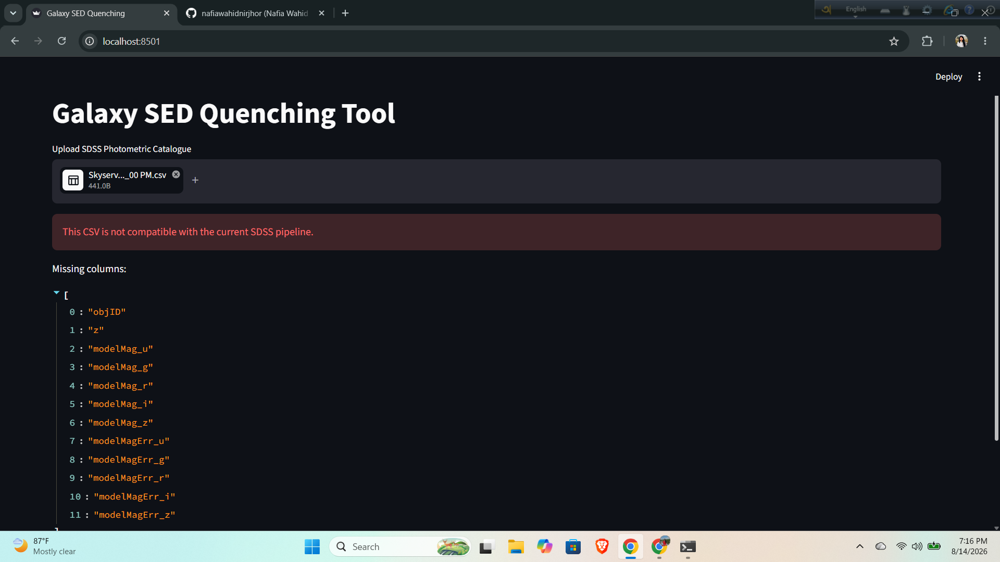
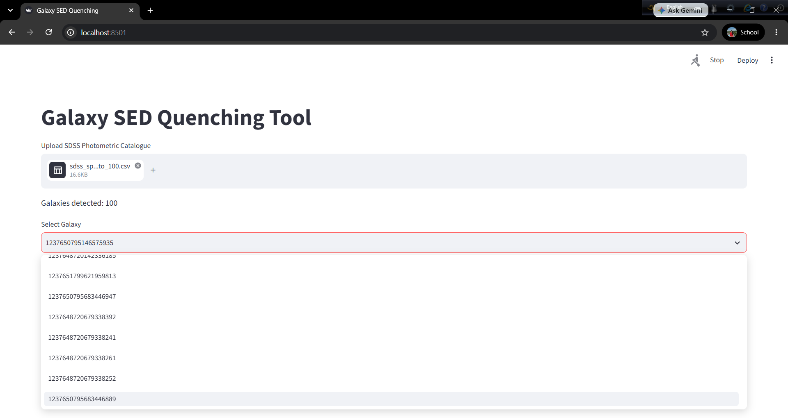
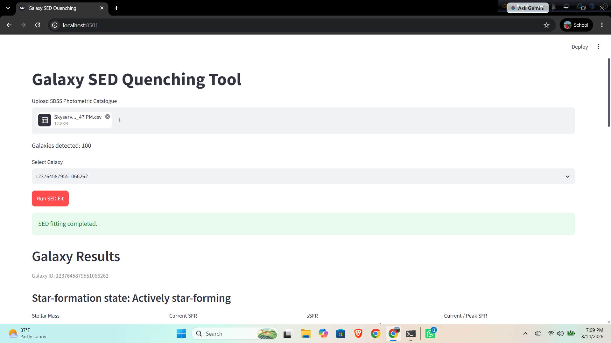
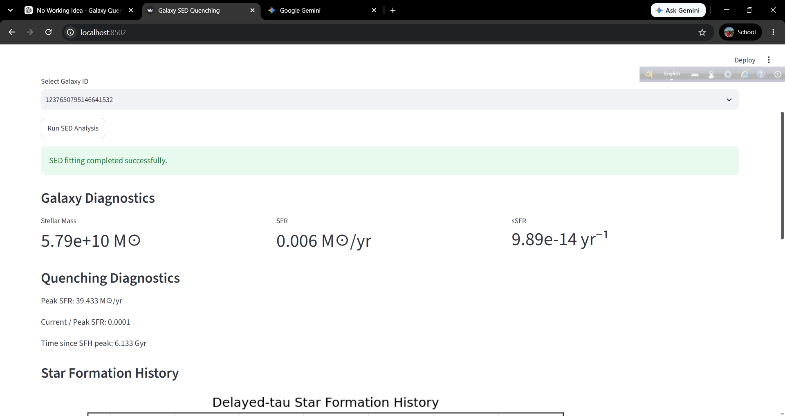
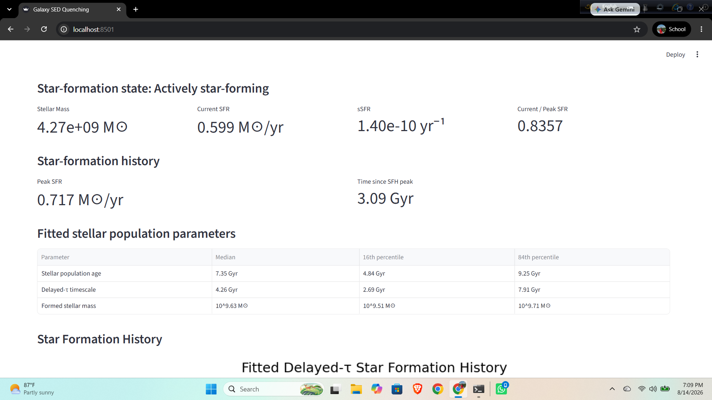
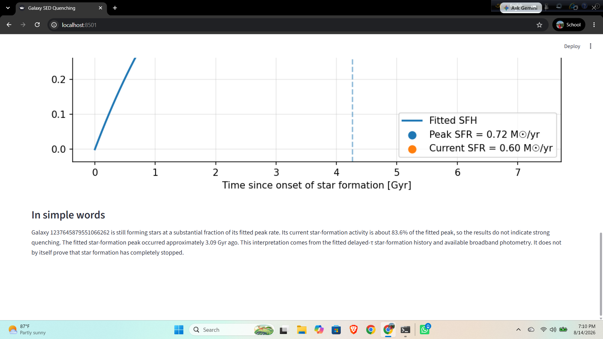
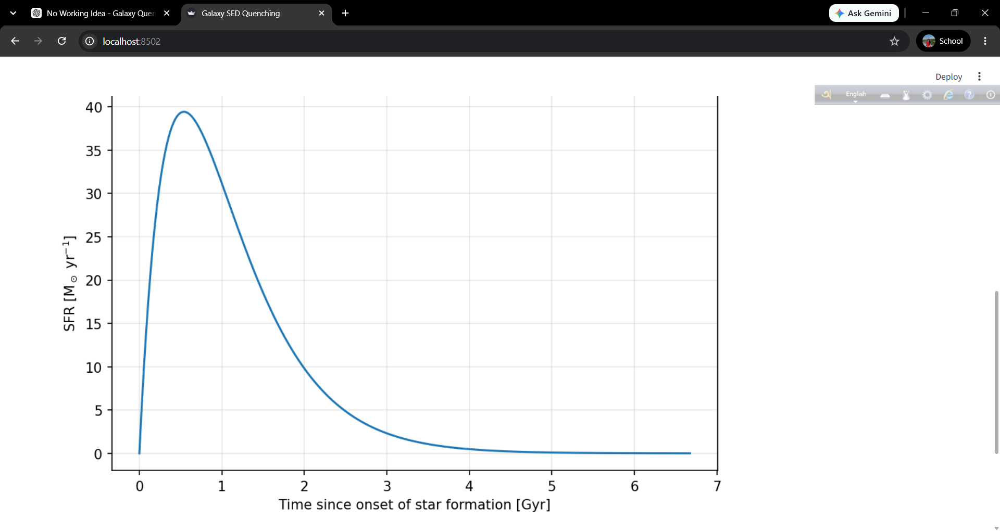
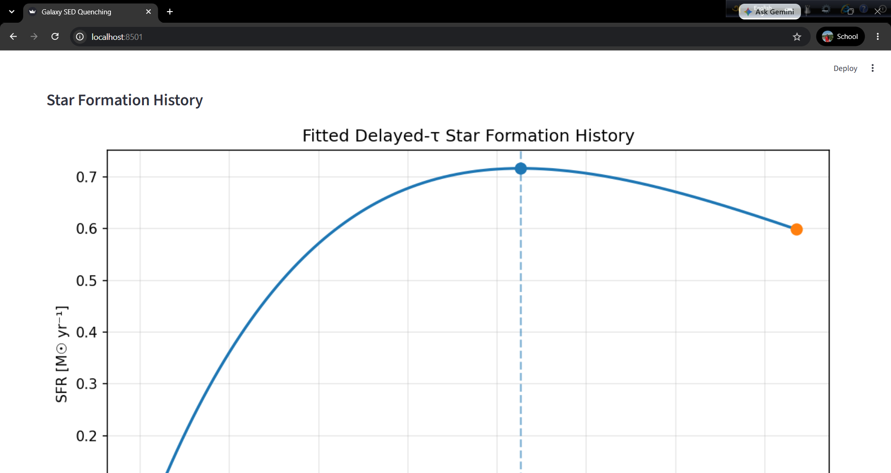
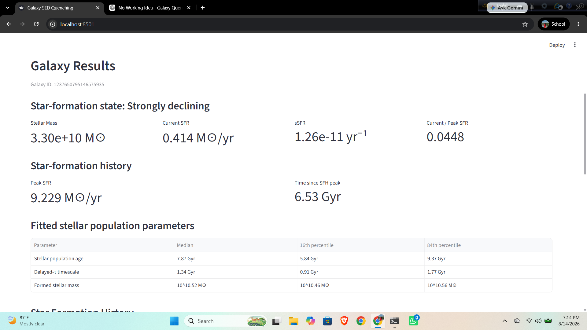

## Application Screenshots

### Application Interface


### Galaxy Selection


### SED Fitting


### Galaxy Results


### Detailed Results


### Summary


### Star Formation History


### Additional SFH Visualization


### Result View
# Galaxy SED Quenching Tool

A Python and Streamlit application for fitting galaxy spectral energy distributions (SEDs) with **BAGPIPES** and estimating star-formation history and quenching diagnostics from SDSS broadband photometry.

## What this project does

The application takes SDSS `u,g,r,i,z` photometry and redshift for a galaxy, performs a delayed-τ SED fit, derives physical star-formation quantities, and classifies the galaxy according to its current activity relative to its fitted peak SFR.

Main outputs:

* Stellar population age
* Delayed-τ timescale
* Formed stellar mass
* Current SFR
* Peak SFR
* Specific SFR
* Current-to-peak SFR ratio
* Time since SFH peak
* Delayed-τ SFH plot
* Qualitative star-formation state

The quenching classification is based on the fitted delayed-τ SFH and should be interpreted as a model-based diagnostic, not proof that star formation has completely stopped.

## Input file

The application currently accepts **CSV files only**.

The uploaded catalogue must contain these columns:

```text
objID
z
modelMag_u
modelMag_g
modelMag_r
modelMag_i
modelMag_z
modelMagErr_u
modelMagErr_g
modelMagErr_r
modelMagErr_i
modelMagErr_z
```

`objID` must be a valid integer SDSS object identifier.

`z` is the galaxy redshift.

`modelMag_*` contains SDSS model magnitudes.

`modelMagErr_*` contains the corresponding magnitude uncertainties.

The application can handle the SDSS catalogue format used in this project, including files containing an initial metadata/comment line.

## Installation

This project was developed with Python 3.10.

Create the environment:

```bash
conda env create -f environment.yml
conda activate bagpipes_env
```

Alternatively, install the Python dependencies:

```bash
pip install -r requirements.txt
```

## Run the web application

From the project root:

```bash
streamlit run app.py
```

Then open the local Streamlit URL shown in the terminal.

## Using the application

1. Upload a compatible SDSS CSV file.
2. Confirm that the detected galaxy count is correct.
3. Select an SDSS galaxy ID.
4. Click **Run SED Fit**.
5. Wait for BAGPIPES to complete the posterior sampling.
6. Inspect the fitted parameters, diagnostics, SFH plot, and interpretation.

SED fitting can take significantly longer than ordinary Python calculations because BAGPIPES performs Bayesian posterior sampling.

## Scientific model

The project uses a delayed-τ star-formation history:

```text
SFR(t) ∝ t exp(-t/τ)
```

The SFH rises initially, reaches a maximum near `t = τ`, and then declines.

The fitting model includes:

* Delayed-τ SFH
* Stellar population age
* Stellar mass formed
* Metallicity
* Calzetti dust attenuation
* Nebular emission
* Fixed galaxy redshift

The current implementation uses SDSS `u,g,r,i,z` broadband photometry rather than spectroscopy.

## Quenching diagnostic

The main activity indicator is:

```text
Current SFR / Peak SFR
```

The current classification is:

```text
ratio >= 0.50    Actively star-forming
ratio >= 0.10    Moderately declining
ratio >= 0.01    Strongly declining
ratio <  0.01    Strongly quenched-like
```

These thresholds are project-defined diagnostic categories rather than universal astrophysical definitions of quenching.

## Project structure

```text
galaxy-sed-quenching/
│
├── app.py
├── requirements.txt
├── environment.yml
├── CITATION.cff
├── README.md
│
├── src/
│   ├── fitting.py
│   ├── sfh.py
│   ├── diagnostics.py
│   ├── interpretation.py
│   ├── pipeline.py
│   └── plotting.py
│
├── tests/
│   ├── test1_single_model.py
│   ├── test2_sfh_inspection.py
│   ├── test3_sdss_bagpipes_input.py
│   ├── test4_first_fit.py
│   ├── test5_extract_posterior.py
│   ├── test6_derive_sfh.py
│   ├── test7_quenching_classification.py
│   ├── test8_plot_sfh.py
│   ├── test9_mock_generation.py
│   ├── test10_fit_mock.py
│   └── additional diagnostic tests
│
├── data/
│   ├── raw/
│   └── filters/
│
├── figures/
├── pipes/
└── logs/
```

## Code overview

`app.py`
Streamlit interface for catalogue upload, galaxy selection, fitting, diagnostics, plotting, and interpretation.

`src/fitting.py`
Validates SDSS input, converts magnitudes to fluxes, constructs the BAGPIPES galaxy object, runs the SED fit, and reads posterior products.

`src/sfh.py`
Implements the delayed-τ SFH model.

`src/diagnostics.py`
Calculates stellar mass, current SFR, peak SFR, sSFR, current-to-peak SFR, and time since the SFH peak.

`src/pipeline.py`
Connects posterior extraction, physical diagnostics, and SFH plotting.

`src/interpretation.py`
Converts the numerical diagnostics into a short qualitative description of the galaxy's star-formation state.

`src/plotting.py`
Generates SFH visualizations.

`tests/`
Contains development and validation scripts covering individual components, BAGPIPES fitting, posterior handling, SFH recovery, diagnostics, and the application pipeline.

## Validation

The project includes controlled delayed-τ mock-data tests and successful SDSS BAGPIPES fitting tests.

The repository also contains example posterior products and SFH figures generated during development.

## Main technologies

* Python
* BAGPIPES
* Streamlit
* NumPy
* Pandas
* Astropy
* SciPy
* Matplotlib
* HDF5 / h5py
* Nautilus sampler

## Scientific scope and limitations

This is a broadband SED-fitting project focused on star-formation history and quenching diagnostics.

The current version does not establish:

* A spectroscopically confirmed quenching event
* A causal mechanism for quenching
* AGN-driven quenching
* Environmental quenching
* A statistically complete population-level quenching relation

The inferred quantities depend on the assumed stellar population model, SFH parameterization, dust prescription, photometric quality, redshift, filter curves, and posterior sampling.

## Reproducibility

The repository records the main software dependencies, analysis modules, tests, figures, posterior products, and development logs required to reproduce the current workflow.

For a new analysis, use a compatible SDSS photometric CSV, install the specified environment, and launch the Streamlit application from the project root.

## Author

**Nafia Wahid Nirjhor**
B.Sc. Physics, Khulna University
Bangladesh

